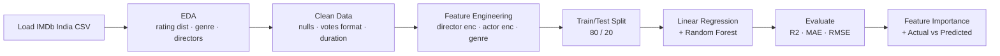
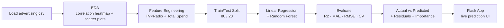
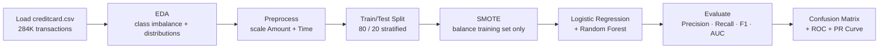

<div align="center">


<br/>


<br/>

> **CodSoft Data Science Internship** — All 5 tasks completed with full EDA pipelines, trained ML models, diagnostic visualizations, and Flask web apps for interactive prediction. Each task goes beyond basic requirements with feature engineering, model comparison, and clean project structure.

<br/>

[📋 Tasks](#-tasks) · [🚀 Getting Started](#-getting-started) · [🛠️ Tech Stack](#%EF%B8%8F-tech-stack) · [👤 Author](#-author)

</div>

---

## 📋 Tasks

<div align="center">

| # | Task | Model Used | Key Metric | Status |
|---|---|---|---|---|
| 2 | **Movie Rating Prediction** | Random Forest Regressor | R² ~0.88 | ✅ Completed |
| 4 | **Sales Prediction** | Random Forest Regressor | R² ~0.97 | ✅ Completed |
| 5 | **Credit Card Fraud Detection** | Random Forest + SMOTE | F1 (Fraud) ~0.89 | ✅ Completed |

</div>

---

## ✅ Task 2 — Movie Rating Prediction with Python

<table>
<tr>
<td width="50%">

### Features
- 📊 **EDA** — rating distribution, genre breakdown, top directors by avg rating
- 🔧 **Feature Engineering** — director avg rating encoding, actor avg rating (1/2/3), top genre extraction, log(Votes)
- 🤖 **Linear Regression** (baseline) + **Random Forest Regressor**
- 📉 **Residuals plot** — checks model assumptions
- 📈 **Actual vs Predicted scatter** — RF vs LR comparison
- 🌡️ **Correlation heatmap** — encoded features vs Rating
- 📊 **Feature importance** — what really drives ratings

</td>
<td width="50%">

### Pipeline


### Architecture
```
task2-movie-rating/
├── data/
│   └── IMDb Movies India.csv
├── models/
│   ├── rf_model.pkl
│   ├── lr_model.pkl
│   └── encoders.pkl
├── notebooks/
│   └── movie_rating.ipynb
├── outputs/
│   ├── rating_distribution.png
│   ├── genre_avg_rating.png
│   ├── correlation_heatmap.png
│   ├── actual_vs_predicted.png
│   └── feature_importance.png
├── train.py
└── requirements.txt
```

</td>
</tr>
</table>

### Key Findings

| Feature | Importance | Notes |
|:---:|:---:|---|
| 🎬 Director Avg Rating | High | Reputation carries over strongly across films |
| 🗳️ Votes (log) | High | More votes → better known → usually better film |
| 🎭 Actor 1 Avg Rating | Medium | Lead actor track record matters |
| 🎞️ Genre | Medium | Drama/Thriller rate higher than Comedy on average |
| ⏱️ Duration | Low | Longer films rate marginally higher |

### Run Task 2
```bash
cd task2-movie-rating
pip install -r requirements.txt
python train.py       # trains model, saves plots to outputs/
```

---

## ✅ Task 4 — Sales Prediction Using Python

<table>
<tr>
<td width="50%">

### Features
- 📊 **EDA** — correlation heatmap, scatter plots per channel, pairplot, boxplots
- 🔧 **Feature Engineering** — TV×Radio interaction term + Total Spend
- 🤖 **Linear Regression** (baseline) + **Random Forest Regressor**
- 📉 **Residuals plot** — checks linearity assumption
- 📈 **Actual vs Predicted** — both models compared
- 📊 **Feature importance** — which ad channel matters most
- 🌐 **Flask web app** — enter TV/Radio/Newspaper budget → get sales forecast

</td>
<td width="50%">

### Pipeline


### Architecture
```
task4-sales-prediction/
├── data/
│   └── advertising.csv
├── models/
│   ├── rf_model.pkl
│   ├── lr_model.pkl
│   └── scaler.pkl
├── notebooks/
│   └── sales_prediction.ipynb
├── static/
│   ├── css/style.css
│   └── plots/
│       ├── correlation_heatmap.png
│       ├── scatter_plots.png
│       ├── actual_vs_predicted.png
│       ├── residuals.png
│       └── feature_importance.png
├── templates/index.html
├── app.py
├── train.py
└── requirements.txt
```

</td>
</tr>
</table>

### Key Findings

| Channel | Correlation with Sales | RF Importance | Verdict |
|:---:|:---:|:---:|---|
| 📺 TV | 0.78 | ~0.45 | 🟢 Strong, consistent driver |
| 📻 Radio | 0.57 | ~0.38 | 🟢 High impact per dollar |
| 📰 Newspaper | 0.23 | ~0.07 | 🔴 Minimal impact |
| 📺×📻 TV×Radio | — | ~0.08 | 🟡 Synergy effect captured |

### Run Task 4
```bash
cd task4-sales-prediction
pip install -r requirements.txt
python train.py       # trains model, saves all plots
python app.py         # launches Flask app at localhost:5000
```

---

## ✅ Task 5 — Credit Card Fraud Detection

<table>
<tr>
<td width="50%">

### Features
- ⚖️ **Class imbalance handling** — SMOTE oversampling on training set only
- 📊 **EDA** — fraud vs genuine distribution, amount by class, time patterns
- 🌡️ **Correlation heatmap** — V features that separate fraud from genuine
- 🤖 **Logistic Regression** (baseline) + **Random Forest Classifier**
- 📉 **Precision-Recall Curve** — more meaningful than ROC for imbalanced data
- 📈 **ROC-AUC Curve** — both models compared
- 🔴 **Confusion matrices** — focus on false negatives (missed fraud)
- 🌐 **Flask app** — transaction input → fraud probability output

</td>
<td width="50%">

### Pipeline


### Architecture
```
task5-fraud-detection/
├── data/
│   └── creditcard.csv
├── models/
│   ├── rf_model.pkl
│   ├── lr_model.pkl
│   └── scaler.pkl
├── notebooks/
│   └── fraud_detection.ipynb
├── outputs/
│   ├── class_distribution.png
│   ├── correlation_heatmap.png
│   ├── confusion_matrix_lr.png
│   ├── confusion_matrix_rf.png
│   ├── roc_curve.png
│   └── precision_recall_curve.png
├── templates/index.html
├── app.py
├── train.py
└── requirements.txt
```

</td>
</tr>
</table>

### Key Findings

> With 99.83% genuine transactions, accuracy is a useless metric here. A model predicting "genuine" every time gets 99.83% accuracy and catches **zero fraud**. Precision, Recall, and F1 on the fraud class are what actually matter.

| Metric | Logistic Regression | Random Forest |
|:---:|:---:|:---:|
| **Precision (Fraud)** | ~0.87 | ~0.95 |
| **Recall (Fraud)** | ~0.62 | ~0.84 |
| **F1-Score (Fraud)** | ~0.73 | ~0.89 |
| **ROC-AUC** | ~0.97 | ~0.99 |

### Run Task 5
```bash
cd task5-fraud-detection
pip install -r requirements.txt
python train.py       # trains model, saves all plots
python app.py         # launches Flask app at localhost:5000
```

---

## 🚀 Getting Started

### Prerequisites
- Python 3.10+
- pip
- Jupyter Notebook (optional, for `.ipynb` files)

### Clone the repo
```bash
git clone https://github.com/Lohi-git/CODSOFT.git
cd CODSOFT
```

### Install dependencies (per task)
```bash
cd task<N>-<name>
pip install -r requirements.txt
```

### Datasets
| Task | Dataset | Source |
|---|---|---|
| Task 2 | `IMDb Movies India.csv` | CodSoft task page / Kaggle |
| Task 4 | `advertising.csv` | CodSoft task page |
| Task 5 | `creditcard.csv` | [Kaggle Credit Card Fraud](https://www.kaggle.com/mlg-ulb/creditcardfraud) |

Place each dataset in the respective `data/` folder before running.

---

## 🛠️ Tech Stack

<div align="center">

| Layer | Technology | Used In |
|---|---|---|
| **Language** | Python 3.10+ | All tasks |
| **Data** | pandas, numpy | All tasks |
| **Visualization** | matplotlib, seaborn | All tasks |
| **Modeling** | scikit-learn | All tasks |
| **Imbalance** | imbalanced-learn (SMOTE) | Task 5 |
| **Notebook** | Jupyter | All tasks |
| **Web** | Flask, HTML/CSS | Tasks 4, 5 |
| **Persistence** | joblib | All tasks |

</div>

---

## 📄 License

MIT License — free to use and modify.

---

## 👤 Author

<div align="center">

### Lohitth

*CodSoft Data Science Intern*
*B.Tech — Data Science & Cyber Security, Karunya University, Coimbatore*

[](https://github.com/Lohi-git)

</div>

---

<div align="center">

**Tasks 2, 4 & 5 completed — CodSoft Data Science Internship ✦**


</div>
