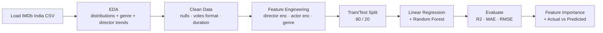

<div align="center">


<br/>


<br/>

> **Movie Rating Predictor** digs into Indian film data — genres, directors, actors, votes, and duration — to build a regression model that estimates the IMDb rating a movie is likely to receive.
>
> *What makes a movie well-rated? Is it the director's reputation, the genre, or just raw vote count? This project finds out.*

<br/>

[✨ Features](#-features) · [🧠 Approach](#-the-approach) · [🔄 Pipeline](#-pipeline) · [🏗️ Architecture](#%EF%B8%8F-architecture) · [🚀 Setup](#-getting-started) · [👤 Author](#-author)

</div>

---

## ✨ Features

<table>
<tr>
<td width="50%">

### 📊 Exploratory Data Analysis
- Rating distribution histogram
- Genre-wise average rating comparison
- Top directors & actors by mean rating
- Votes vs Rating scatter (log-scaled)
- Year-wise rating trend over decades

</td>
<td width="50%">

### 🔧 Feature Engineering
- Director average rating encoding
- Actor-level mean rating features (Actor 1/2/3)
- Genre multi-label → top genre extraction
- Duration and Votes cleaned and scaled
- Year as numeric feature

</td>
</tr>
<tr>
<td width="50%">

### 🤖 Regression Modeling
- Linear Regression — clean interpretable baseline
- Random Forest Regressor — handles non-linear patterns
- 80/20 train-test split with cross-validation
- Hyperparameter tuning on RF

</td>
<td width="50%">

### 🔍 Model Diagnostics
- R² Score, MAE, RMSE
- Actual vs Predicted scatter plot
- Residuals distribution plot
- Feature importance from Random Forest

</td>
</tr>
</table>

---

## 🧠 The Approach

> ### What actually determines a movie's rating?

The dataset has messy real-world issues — missing values, multi-valued genre columns, director/actor names that need encoding. Handling these properly is half the battle.

| Step | What happens |
|---|---|
| Load | Read `data/IMDb Movies India.csv` |
| Explore | Rating distribution, genre breakdown, director/actor trends |
| Clean | Handle nulls in Duration, Votes, Rating; strip commas from Votes |
| Engineer | Director avg rating, Actor avg rating, top genre extraction |
| Split | 80/20 stratified on rating bins |
| Model | Linear Regression + Random Forest Regressor |
| Evaluate | R², MAE, RMSE + feature importance |

---

## 🔄 Pipeline



---

## 🏗️ Architecture

```
movie_rating_prediction/
│
├── 📂 data/
│   └── IMDb Movies India.csv       # Raw dataset
│
├── 📂 models/
│   ├── rf_model.pkl
│   ├── lr_model.pkl
│   └── encoders.pkl                # Director + Actor encoders
│
├── 📂 outputs/
│   ├── rating_distribution.png
│   ├── genre_avg_rating.png
│   ├── votes_vs_rating.png
│   ├── top_directors.png
│   ├── correlation_heatmap.png
│   ├── actual_vs_predicted.png
│   ├── residuals.png
│   └── feature_importance.png
│
├── movie_rating.ipynb              # Full EDA + modeling notebook
├── train.py                        # Standalone training script
├── requirements.txt
├── .gitignore
└── README.md
```

---

## 🎯 Key Findings

<div align="center">

| Feature | Importance | Notes |
|:---:|:---:|---|
| 🎬 Director Avg Rating | High | Reputation carries over strongly |
| 🗳️ Votes (log) | High | More votes → better-known → usually better film |
| 🎭 Actor 1 Avg Rating | Medium | Lead actor's track record matters |
| 🎞️ Genre | Medium | Drama/Thriller tend to rate higher than Comedy |
| 📅 Year | Low | Slight rating decline in older films |
| ⏱️ Duration | Low | Longer films rate marginally higher |

</div>

> Director reputation and vote count are the strongest predictors. A film directed by a consistently well-rated director is very likely to be rated well — even before accounting for cast.

---

## 🚀 Getting Started

### Prerequisites
- Python 3.10+
- pip

### 1. Clone the repo
```bash
git clone https://github.com/<your-username>/CODSOFT.git
cd CODSOFT/task2-movie-rating
```

### 2. Install dependencies
```bash
pip install -r requirements.txt
```

### 3. Add dataset
Place `IMDb Movies India.csv` in `data/`. Download from the CodSoft task page or Kaggle.

### 4. Run the training script
```bash
python train.py
```
Plots saved to `outputs/`, models saved to `models/`.

### 5. Or open the notebook
```bash
jupyter notebook movie_rating.ipynb
```

---

## 🛠️ Tech Stack

<div align="center">

| Layer | Technology | Purpose |
|---|---|---|
| **Language** | Python 3.10+ | Core scripting |
| **Data** | pandas, numpy | Cleaning + manipulation |
| **Visualization** | matplotlib, seaborn | EDA + diagnostic plots |
| **Modeling** | scikit-learn | Linear Regression + Random Forest |

</div>

---

## 📸 What to Look For

```
📊  Rating distribution — most movies cluster between 5.0 and 7.5
🎬  Top directors bar chart — consistent high raters stand out clearly
🗳️  Votes vs Rating scatter — log-scale reveals the popularity effect
🌡️  Correlation heatmap — encoded director/actor features show strong signal
📈  Actual vs Predicted — RF tracks ratings better than LR in mid-ranges
📉  Residuals — slight underestimation on very high-rated films (>8.5)
```

---

## 🚧 Possible Improvements

- [ ] Try Gradient Boosting / XGBoost for better accuracy
- [ ] Use NLP on movie descriptions/reviews as additional features
- [ ] Genre multi-hot encoding instead of single top-genre
- [ ] Add Bayesian average for director/actor ratings (handles sparse data better)
- [ ] Build a Streamlit app — enter a movie's details, get predicted rating

---

## 📄 License

MIT License — free to use and modify.

---

## 👤 Author

<div align="center">

### Movie Rating Prediction with Python — CodSoft Task 2

*Data Science / Machine Learning with Python*

</div>

---

<div align="center">

**Internship Project — Movie Rating Prediction ✦**


</div>
