<div align="center">


<br/>


<br/>

> **Fraud Detector** uses Random Forest + SMOTE to identify fraudulent credit card transactions from 284,807 real-world records — where only **0.17%** are actually fraud.
>
> *Spoiler: accuracy is a useless metric here. We care about Recall, F1, and ROC-AUC — and the model nails all three.*

<br/>

[✨ Features](#-features) · [🧠 Approach](#-the-approach) · [🔄 Pipeline](#-pipeline) · [🏗️ Architecture](#%EF%B8%8F-architecture) · [🚀 Setup](#-getting-started) · [👤 Author](#-author)

</div>

---

## ✨ Features

<table>
<tr>
<td width="50%">

### 📊 Exploratory Data Analysis
- Class imbalance visualization (bar + pie)
- Amount & Time distribution by class
- Correlation heatmap across all V1–V28 features
- Feature correlation with fraud label

</td>
<td width="50%">

### 🤖 ML Modeling
- **Logistic Regression** baseline
- **Random Forest** final model
- SMOTE oversampling on training data only
- StandardScaler on Amount feature

</td>
</tr>
<tr>
<td width="50%">

### 🔍 Evaluation
- Confusion Matrix (seaborn heatmap)
- ROC-AUC & Precision-Recall curves
- Classification report (Precision, Recall, F1)
- Side-by-side model comparison

</td>
<td width="50%">

### 🌐 Full Stack Deployment
- Flask REST API (`/predict`, `/health`)
- Interactive Web UI (vanilla HTML/CSS/JS)
- Load sample transaction button
- Real-time fraud probability display

</td>
</tr>
</table>

---

## 🧠 The Approach

> ### Why accuracy doesn't matter here

With only 0.17% fraud cases, a model predicting everything as "Legit" gets **99.83% accuracy** while catching **zero fraud**. So we focus on:

| Metric | Why it matters |
|---|---|
| **Recall** | Are we catching actual fraud? |
| **Precision** | Are our fraud flags legit? |
| **F1 Score** | Balance of both |
| **ROC-AUC** | Overall model quality at all thresholds |

| Step | What happens |
|---|---|
| Load | Read `creditcard.csv` — 284,807 transactions |
| Explore | Class imbalance, amount/time distributions, correlations |
| Preprocess | Drop `Time`, scale `Amount`, train/test split |
| Balance | Apply **SMOTE** to training data only |
| Model | Logistic Regression + Random Forest |
| Evaluate | Confusion matrix, ROC-AUC, Precision-Recall |
| Deploy | Flask API + Web UI |

---

## 🔄 Pipeline

```mermaid
flowchart LR
  A[Load creditcard.csv\n284807 transactions] --> B[EDA\nimbalance + distributions]
  B --> C[Preprocess\nDrop Time, Scale Amount]
  C --> D[Train/Test Split\n80 / 20 stratified]
  D --> E[SMOTE\nbalance training data]
  E --> F[Train Models\nLR + Random Forest]
  F --> G[Evaluate\nConfusion Matrix + ROC-AUC]
  G --> H[Save Model\nrf_model.pkl + scaler.pkl]
  H --> I[Flask API\n/predict endpoint]
  I --> J[Web UI\nReal-time predictions]
```



---

## 🏗️ Architecture

```
credit-card-fraud-detection/
│
├── 📂 backend/
│   ├── app.py               # Flask REST API
│   ├── train.py             # EDA + training + save model
│   └── requirements.txt
│
├── 📂 frontend/
│   └── index.html           # Web UI — no frameworks
│
├── 📂 notebook/
│   └── credit_card_fraud_detection.ipynb   # Full EDA + modelling
│
├── 📂 models/               # Generated after training
│   ├── rf_model.pkl
│   └── scaler.pkl
│
├── .gitignore
└── README.md
```

---

## 🎯 Key Results

<div align="center">

| Model | Precision | Recall | F1 Score | ROC-AUC |
|:---:|:---:|:---:|:---:|:---:|
| Logistic Regression | ~0.87 | ~0.62 | ~0.72 | ~0.97 |
| **Random Forest** | **~0.95** | **~0.82** | **~0.88** | **~0.98** |

</div>

Random Forest wins across every metric. High recall means we're catching most actual fraud. High precision means we're not flooding customers with false alerts.

---

## 🚀 Getting Started

### Prerequisites
- Python 3.10+
- pip
- `creditcard.csv` from [Kaggle](https://www.kaggle.com/datasets/mlg-ulb/creditcardfraud) placed in root folder

### 1. Clone the repo
```bash
git clone https://github.com/Lohi-git/CODSOFT.git
cd CODSOFT/credit-card-fraud-detection
```

### 2. Install dependencies
```bash
pip install -r backend/requirements.txt
```

### 3. Train the model
```bash
python backend/train.py
```

### 4. Start the API
```bash
python backend/app.py
```

### 5. Open the UI
Open `frontend/index.html` in your browser — click **Load Sample** then **Analyze Transaction**.

---

## 🛠️ Tech Stack

<div align="center">

| Layer | Technology | Purpose |
|---|---|---|
| **Language** | Python 3.10+ | Core scripting |
| **Data** | pandas, numpy | Cleaning + manipulation |
| **Visualization** | matplotlib, seaborn | EDA + evaluation plots |
| **Modeling** | scikit-learn | LR + Random Forest |
| **Imbalance** | imbalanced-learn | SMOTE oversampling |
| **Backend** | Flask, flask-cors | REST API |
| **Frontend** | HTML, CSS, JS | Web UI |

</div>

---

## 📸 Demo Highlights

```
📊  0.17% fraud rate — extreme imbalance visible immediately
🔵  SMOTE balances training set from 0.17% → 50% fraud
🔴  Confusion matrix — RF catches 82%+ of actual fraud
📈  ROC-AUC ~0.98 — near perfect separation
🌐  Web UI — paste V1-V28 values, get instant fraud probability
```

---

## 🚧 Possible Improvements

- [ ] Try XGBoost / LightGBM for better recall
- [ ] Tune decision threshold based on business cost
- [ ] Add random under-sampling as alternative to SMOTE
- [ ] K-fold cross-validation
- [ ] Deploy on Render / Railway

---

## 📄 License

MIT License — free to use and modify.

---

## 👤 Author

<div align="center">

### M. Lohitth

[](https://www.linkedin.com/in/m-lohitth-1619b7378/)
[](https://github.com/Lohi-git)

*Data Science Intern — CodSoft | B.Tech Data Science & Cyber Security, Karunya University*

</div>

---

<div align="center">

**CodSoft Internship — Task 5 : Credit Card Fraud Detection ✦**


</div>
