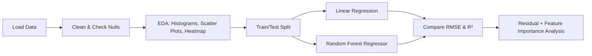

<div align="center">

# 📈 Sales Prediction Using Python

### CodSoft Data Science Internship — Task 4

Predicting product sales from advertising spend across **TV**, **Radio**, and **Newspaper** channels using regression.


</div>

---

## 🧠 Overview

This project explores whether the amount spent on different advertising channels can predict how much a product will sell. Spoiler: not all channels are created equal — TV spend turns out to be doing most of the heavy lifting.

| | |
|---|---|
| **Task** | Sales Prediction Using Python (Task 4) |
| **Type** | Regression |
| **Models used** | Linear Regression, Random Forest Regressor |
| **Metrics** | RMSE, R² |
| **Dataset** | Advertising dataset (TV / Radio / Newspaper → Sales) |

---

## 📁 Project Structure

```
sales-prediction-project/
├── 📂 data/
│   └── advertising.csv        ← add this yourself (see Setup below)
├── 📂 notebook/
│   └── sales_prediction.ipynb ← main notebook
├── 📄 requirements.txt
├── 📄 .gitignore
└── 📄 README.md
```

---

## ⚙️ Setup

### 1. Clone the repo
```bash
git clone https://github.com/<your-username>/CODSOFT.git
cd CODSOFT/sales-prediction-project
```

### 2. Install dependencies
```bash
pip install -r requirements.txt
```

### 3. Add the dataset
Download the Advertising dataset from the link in the task PDF and place it here:
```
data/advertising.csv
```
> Not committed to the repo since the raw data isn't mine to redistribute.

### 4. Run the notebook
```bash
jupyter notebook notebook/sales_prediction.ipynb
```
Or run it headless and save the output:
```bash
jupyter nbconvert --to notebook --execute notebook/sales_prediction.ipynb --output sales_prediction_output.ipynb
```

---

## 🛠️ Windows Troubleshooting

<details>
<summary><b>⚠️ pip install fails with a long-path OSError</b></summary>

<br>

If the error mentions a deeply nested `jupyterlab/galata` path, Windows' 260-character path limit is the cause.

**Fix 1 — Enable long paths (one-time, needs a restart)**

Run in **PowerShell as Administrator**:
```powershell
New-ItemProperty -Path "HKLM:\SYSTEM\CurrentControlSet\Control\FileSystem" -Name "LongPathsEnabled" -Value 1 -PropertyType DWORD -Force
```
Restart your PC, then re-run `pip install -r requirements.txt`.

**Fix 2 — Skip JupyterLab, use classic Notebook (faster, no restart)**
```bash
pip uninstall jupyterlab -y
pip install notebook
jupyter notebook notebook/sales_prediction.ipynb
```

</details>

<details>
<summary><b>⚠️ "jupyter is not recognized" as a command</b></summary>

<br>

The installer likely failed partway, so the launcher script was never created. After fixing the install (above), if it's still not recognized, run it through Python directly:
```bash
python -m notebook notebook/sales_prediction.ipynb
```

</details>

---

## 🔍 Approach



1. **Cleaning** — dropped a leftover index column, checked for nulls (there were none)
2. **EDA** — histograms per channel, scatter plots vs Sales, and a correlation heatmap
3. **Modeling** — trained a Linear Regression baseline, then a Random Forest Regressor
4. **Evaluation** — compared both models on RMSE and R², plotted actual vs predicted, and checked feature importances

---

## 📊 Key Finding

> **TV ad spend is the strongest driver of Sales** by a wide margin. Radio has a moderate effect. Newspaper barely moves the needle.

| Channel | Correlation with Sales | Verdict |
|---|---|---|
| 📺 TV | ~0.78 | Strongest predictor |
| 📻 Radio | ~0.35 | Moderate effect |
| 📰 Newspaper | ~0.23 | Minimal impact |

Both the correlation heatmap and the Random Forest's feature importance scores agree on this — a nice sanity check that the model learned something sensible rather than just noise.

---

## 🚀 Possible Improvements

- [ ] Add interaction terms (e.g. `TV × Radio`) — channels might work better combined
- [ ] Hyperparameter tuning on the Random Forest
- [ ] Try Gradient Boosting / XGBoost for comparison
- [ ] K-fold cross-validation instead of a single train/test split

---

<div align="center">

Built as part of the **CodSoft Data Science Internship**

`#codsoft` `#internship` `#datascience` `#machinelearning` `#python`

</div>
