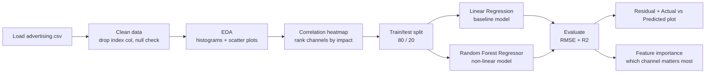

<div align="center">


<br/>


<br/>

> **Sales Predictor** uses regression to figure out how much advertising spend across **TV**, **Radio**, and **Newspaper** actually translates into Sales — and which channel is pulling the most weight.
>
> *Spoiler: not every advertising dollar is equal. One channel does most of the heavy lifting, and the model proves it.*

<br/>

[✨ Features](#-features) · [🧠 Approach](#-the-approach) · [🔄 Pipeline](#-pipeline) · [🏗️ Architecture](#%EF%B8%8F-architecture) · [🚀 Setup](#-getting-started) · [👨‍💻 Author](#-author)

</div>

---

## ✨ Features

<table>
<tr>
<td width="50%">

### 📊 Exploratory Data Analysis
- Distribution histograms for every ad channel
- Scatter plots — spend vs Sales per channel
- Full correlation heatmap
- Multicollinearity check between channels

</td>
<td width="50%">

### 🤖 Dual Model Comparison
- 📈 **Linear Regression** — clean baseline model
- 🌲 **Random Forest Regressor** — captures non-linear effects
- Side-by-side RMSE & R² comparison
- Custom random state for reproducibility

</td>
</tr>
<tr>
<td width="50%">

### 🔍 Model Diagnostics
- Actual vs Predicted scatter plot
- Random Forest feature importance ranking
- Coefficient breakdown per channel
- Sanity check: heatmap vs feature importance agreement

</td>
<td width="50%">

### 🧹 Data Cleaning
- Null value audit
- Leftover index column removal
- Clean train/test split (80/20)
- No missing values, minimal preprocessing needed

</td>
</tr>
</table>

---

## 🧠 The Approach

> ### Which advertising channel actually drives sales?

Most beginner regression projects stop at "fit a model and report the score." This one goes a step further — it asks **why** the model predicts what it predicts.

| Step | What happens |
|---|---|
| Clean | Drop junk columns, confirm no nulls |
| Explore | Histograms + scatter plots per channel |
| Correlate | Heatmap to rank channels by relationship strength |
| Split | 80/20 train-test split |
| Model | Linear Regression baseline → Random Forest comparison |
| Evaluate | RMSE, R², actual-vs-predicted plot |
| Explain | Feature importance to confirm *why* the model predicts what it predicts |

---

## 🔄 Pipeline



---

## 🏗️ Architecture

```
sales-prediction-project/
│
├── 📂 data/
│   └── advertising.csv         # TV / Radio / Newspaper → Sales (gitignored)
│
├── 📓 notebook/
│   └── sales_prediction.ipynb  # EDA + Linear Regression + Random Forest
│                                # Correlation heatmap
│                                # Residual & feature importance analysis
│
├── requirements.txt
├── .gitignore                  # data/*.csv excluded
└── README.md
```

---

## 🎯 Key Finding

<div align="center">

| Channel | Correlation with Sales | Verdict |
|:---:|:---:|---|
| 📺 TV | ~0.78 | 🟢 Strongest predictor |
| 📻 Radio | ~0.35 | 🟡 Moderate effect |
| 📰 Newspaper | ~0.23 | 🔴 Minimal impact |

</div>

Both the correlation heatmap **and** the Random Forest's feature importance scores agree — a nice sanity check that the model learned something real instead of just fitting noise.

---

## 🚀 Getting Started

### Prerequisites
- Python 3.10+
- pip

### 1. Clone the repo
```bash
git clone https://github.com/Lohi-git/CODSOFT.git
cd CODSOFT/sales-prediction-project
```

### 2. Install dependencies
```bash
pip install -r requirements.txt
```

### 3. Add the dataset
Download the Advertising dataset (linked in the task PDF) and place it at:
```
data/advertising.csv
```
> Not committed to the repo — the raw dataset isn't mine to redistribute.

### 4. Run the notebook
```bash
jupyter notebook notebook/sales_prediction.ipynb
```
Or run it headless and save the output:
```bash
jupyter nbconvert --to notebook --execute notebook/sales_prediction.ipynb --output sales_prediction_output.ipynb
```

---

## 🛠️ Windows Troubleshooting

<details>
<summary><b>⚠️ pip install fails with a long-path OSError</b></summary>

<br/>

If the error mentions a deeply nested `jupyterlab/galata` path, Windows' 260-character path limit is the cause.

**Fix 1 — Enable long paths (one-time, needs a restart)**

Run in **PowerShell as Administrator**:
```powershell
New-ItemProperty -Path "HKLM:\SYSTEM\CurrentControlSet\Control\FileSystem" -Name "LongPathsEnabled" -Value 1 -PropertyType DWORD -Force
```
Restart your PC, then re-run `pip install -r requirements.txt`.

**Fix 2 — Skip JupyterLab, use classic Notebook instead (faster, no restart)**
```bash
pip uninstall jupyterlab -y
pip install notebook
jupyter notebook notebook/sales_prediction.ipynb
```

</details>

<details>
<summary><b>⚠️ "jupyter is not recognized" as a command</b></summary>

<br/>

The installer likely failed partway, so the launcher script was never created. Run it through Python directly instead:
```bash
python -m notebook notebook/sales_prediction.ipynb
```

</details>

---

## 🛠️ Tech Stack

<div align="center">

| Layer | Technology | Purpose |
|---|---|---|
| **Language** | Python 3.10+ | Core scripting |
| **Notebook** | Jupyter | Interactive analysis |
| **Data** | pandas, numpy | Cleaning + manipulation |
| **Visualization** | matplotlib, seaborn | EDA + diagnostic plots |
| **Modeling** | scikit-learn | Linear Regression + Random Forest |

</div>

---

## 📸 Demo Highlights

Things to look for when you run the notebook:

```
📊  Histograms — Newspaper spend is skewed, TV is evenly spread
🔵  TV vs Sales scatter — clean upward trend, almost linear by eye
🟠  Radio vs Sales scatter — trend exists but noisier
🟢  Newspaper vs Sales scatter — looks like a blob, weak relationship
🔥  Correlation heatmap — confirms TV >> Radio >> Newspaper
🌲  Random Forest feature importance — same ranking as the heatmap
📈  Actual vs Predicted plot — points hug the perfect-prediction line
```

---

## 🚧 Possible Improvements

- [ ] Add interaction terms (e.g. `TV × Radio`)
- [ ] Hyperparameter tuning on the Random Forest
- [ ] Try Gradient Boosting / XGBoost for comparison
- [ ] K-fold cross-validation instead of a single train/test split

---

## 📄 License

MIT License — free to use and modify.

---

## 👨‍💻 Author

<div align="center">

### M Lohitth

*CodSoft Data Science Intern*

[](https://www.linkedin.com/in/m-lohitth-1619b7378/)
[](https://github.com/Lohi-git)

</div>

---

<div align="center">

**CodSoft Data Science Internship — Task 4 ✦**


</div>
