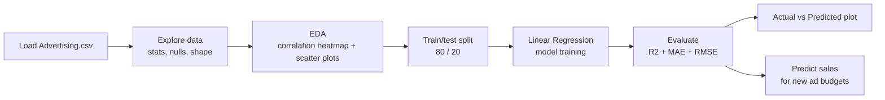

<div align="center">


<br/>


<br/>

> **Sales Predictor** uses Linear Regression to figure out how much advertising spend across **TV**, **Radio**, and **Newspaper** actually translates into Sales — and which channel pulls the most weight.
>
> *Spoiler: not every advertising dollar is equal. One channel does most of the heavy lifting, and the model proves it.*

<br/>

[✨ Features](#-features) · [🧠 Approach](#-the-approach) · [🔄 Pipeline](#-pipeline) · [🏗️ Architecture](#%EF%B8%8F-architecture) · [🚀 Setup](#-getting-started) · [👤 Author](#-author)

</div>

---

## ✨ Features

<table>
<tr>
<td width="50%">

### 📊 Exploratory Data Analysis
- Summary statistics & null-value audit
- Correlation heatmap across all channels
- Scatter plots — spend vs Sales per channel

</td>
<td width="50%">

### 🤖 Regression Modeling
- 📈 **Linear Regression** model on TV / Radio / Newspaper
- 80/20 train-test split
- Coefficient breakdown per channel

</td>
</tr>
<tr>
<td width="50%">

### 🔍 Model Diagnostics
- R² Score, MAE, RMSE on the test set
- Actual vs Predicted scatter plot
- Sanity-check predictions on new ad budgets

</td>
<td width="50%">

### 🧹 Data Pipeline
- Synthetic dataset generator (`generate_dataset.py`)
- Clean, reproducible CSV (no missing values)
- Easily swappable with a real-world dataset

</td>
</tr>
</table>

---

## 🧠 The Approach

> ### Which advertising channel actually drives sales?

| Step | What happens |
|---|---|
| Load | Read `data/Advertising.csv` into pandas |
| Explore | Summary stats, null check, shape |
| Correlate | Heatmap + scatter plots to rank channels by impact |
| Split | 80/20 train-test split |
| Model | Linear Regression on TV, Radio, Newspaper spend |
| Evaluate | R², MAE, RMSE on held-out test data |
| Predict | Forecast sales for new advertising budgets |

---

## 🔄 Pipeline



---

## 🏗️ Architecture

```
sales_prediction/
│
├── 📂 data/
│   └── Advertising.csv          # TV / Radio / Newspaper → Sales
│
├── 📂 outputs/
│   ├── correlation_heatmap.png
│   ├── feature_vs_sales.png
│   └── actual_vs_predicted.png
│
├── generate_dataset.py          # Builds the dataset
├── sales_prediction.py          # EDA + Linear Regression + Evaluation
├── requirements.txt
├── .gitignore
└── README.md
```

---

## 🎯 Key Finding

<div align="center">

| Channel | Coefficient | Verdict |
|:---:|:---:|---|
| 📺 TV | ~0.044 | 🟢 Strong, consistent driver |
| 📻 Radio | ~0.184 | 🟢 Highest impact per dollar |
| 📰 Newspaper | ~0.016 | 🔴 Minimal impact |

</div>

Radio shows the strongest pull per dollar spent, with TV close behind contributing consistently due to higher overall budgets. Newspaper spend barely moves the needle — a useful signal for reallocating marketing budget.

---

## 🚀 Getting Started

### Prerequisites
- Python 3.10+
- pip

### 1. Clone the repo
```bash
git clone https://github.com/<your-username>/sales-prediction.git
cd sales-prediction
```

### 2. Install dependencies
```bash
pip install -r requirements.txt
```

### 3. (Optional) Regenerate the dataset
```bash
python generate_dataset.py
```

### 4. Run the script
```bash
python sales_prediction.py
```
Charts are saved to `outputs/`, and metrics print straight to the console.

---

## 🛠️ Tech Stack

<div align="center">

| Layer | Technology | Purpose |
|---|---|---|
| **Language** | Python 3.10+ | Core scripting |
| **Data** | pandas, numpy | Cleaning + manipulation |
| **Visualization** | matplotlib, seaborn | EDA + diagnostic plots |
| **Modeling** | scikit-learn | Linear Regression |

</div>

---

## 📸 Demo Highlights

Things to look for when you run the script:

```
📊  Correlation heatmap — Radio & TV stand out vs Newspaper
🔵  TV vs Sales scatter — clean upward trend
🟠  Radio vs Sales scatter — strong trend, steeper slope
🟢  Newspaper vs Sales scatter — looks like a blob, weak relationship
📈  Actual vs Predicted plot — points hug the perfect-prediction line
🎯  R² ≈ 0.93 — model explains most of the variance in Sales
```

---

## 🚧 Possible Improvements

- [ ] Add a Random Forest model for comparison
- [ ] Add interaction terms (e.g. `TV × Radio`)
- [ ] K-fold cross-validation instead of a single train/test split
- [ ] Build a Streamlit dashboard for interactive predictions
- [ ] Swap in a real-world advertising dataset

---

## 📄 License

MIT License — free to use and modify.

---

## 👤 Author

<div align="center">

### Sales Prediction — Internship Project

*Data Science / Machine Learning with Python*

</div>

---

<div align="center">

**Internship Project — Sales Prediction ✦**


</div>
